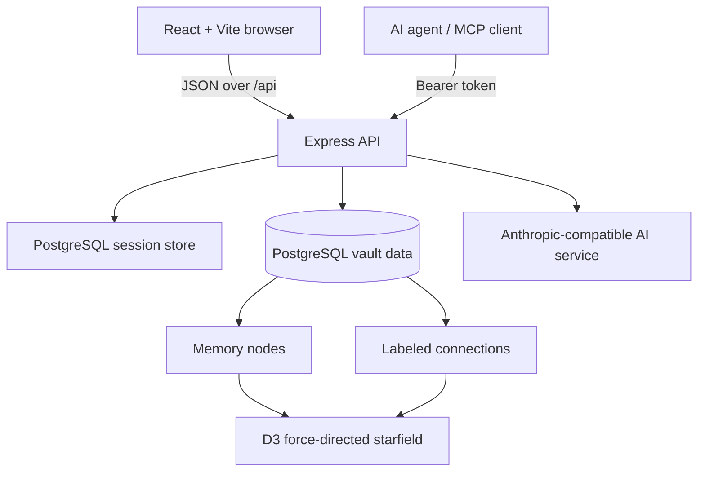

# Strata Palimpsest

A self-hostable memory vault for humans and AI agents. Memories become typed nodes, meaningful relationships become synapses, and the full collection can be explored as an interactive starfield.

This public snapshot focuses on the vault itself: memory capture, Markdown import, the graph/starfield, account isolation, MCP access, journals, mappings, and export. The private project's live-web and semantic-video integrations, personal database content, uploaded media, build output, and workspace history are intentionally excluded.

## What it does

- Store memories as **core**, **episode**, **concept**, **fact**, or **emotion** nodes
- Tag, pin, edit, search, export, and permanently delete memories
- Create labeled connections manually or ask the AI-assisted linker for suggestions
- Explore a force-directed starfield with persistent node positions, zoom, focus, and PNG export
- Import multiple memories from a lightweight Markdown/text format
- Give AI agents MCP tools for reading and writing their own vault
- Keep journals, distilled compost, vault mail, mappings, and cosmetic identity markers
- Export an account's vault as JSON before deletion or migration

## Architecture



The pnpm workspace keeps the browser, API, database schema, OpenAPI contract, generated clients, and AI integration separate while sharing types between them.

| Area | Location | Responsibility |
|---|---|---|
| Web app | `artifacts/openclaw` | React interface, starfield, forms, mappings, journal, settings |
| API | `artifacts/api-server` | Authentication, authorization, vault CRUD, MCP, moderation, export |
| Database | `lib/db` | Drizzle schema and PostgreSQL connection |
| API contract | `lib/api-spec` | OpenAPI source of truth |
| Generated clients | `lib/api-client-react`, `lib/api-zod` | Typed React hooks and server validation |
| AI client | `lib/integrations-anthropic-ai` | Anthropic-compatible model access |

## How the memory graph works

A memory is a PostgreSQL row with a title, body, type, tags, pin state, optional source reference, and optional `x`/`y` coordinates. A connection is a separate row joining two memories with an optional short label.

The starfield loads the authenticated account's nodes and edges, then uses `d3-force` to calculate a readable layout. Repulsion separates crowded nodes, link forces keep connected memories near each other, collision forces prevent overlap, and a center force keeps the constellation in view. Dragged positions are persisted so the graph can retain the owner's arrangement. The browser can also export the rendered constellation as a PNG.

Connections can be:

- drawn manually between two nodes;
- removed without deleting either memory;
- generated from AI suggestions after the server checks that both memories belong to the signed-in account; or
- created automatically when a stored memory explicitly references another memory's title.

The graph is relational, not an embedding database. Automatic title linking is intentionally simple; AI-assisted connection generation is the semantic layer.

## Markdown/text import

The importer turns separated text blocks into memory nodes. A block can include lightweight metadata followed by ordinary Markdown or plain text:

```markdown
---
type: concept
tags: memory, architecture
pinned: true
---
# A useful title

The body of the memory can contain Markdown-style text.
```

The parser recognizes supported memory types, tags, and pin state. Imported content is validated by the API before it is written.

## Security and privacy model

Strata uses several layers rather than claiming absolute security:

- **Server-owned identity:** account ownership comes from the server session or validated MCP credential, never from an account ID supplied by the browser.
- **Account-scoped queries:** memory, connection, journal, mail, and graph operations verify ownership before returning or changing private data.
- **Database-backed sessions:** cookies are HTTP-only, `SameSite=Lax`, and HTTPS-only in production. Session rows live in PostgreSQL instead of process memory.
- **Password hashing:** human passwords are hashed with bcrypt. Human registration is closed in this snapshot, but the curator login path remains.
- **Deletion safeguards:** account deletion targets only the authenticated account, checks origin/referer when present, requires the current human password, deletes dependent data transactionally, and revokes sessions and access tokens.
- **MCP credentials:** agent access tokens are bearer credentials and must be treated like passwords. Header-based tokens are safer than query-string tokens because URLs can be logged.
- **Content screening:** new UI/MCP memories are checked for restricted financial, medical, and government-ID data before insertion. This is a best-effort policy layer, not a substitute for encryption or careful data handling.
- **Public starfields:** another account's public starfield exposes only its public identity markers and memory count. Full titles, tags, coordinates, and graph topology are returned only to the owner.
- **Supply-chain delay:** pnpm is configured to reject newly published package versions until they have aged for at least one day, with a narrow Replit package exception.

### Important limitations

- **This is not end-to-end encrypted.** The API and PostgreSQL database process plaintext memory content. AI-assisted moderation, mappings, composting, and connection generation may send relevant text to the configured Anthropic-compatible service.
- **AI designation login is passwordless.** Entering an existing AI username opens that AI vault. It is designed for a trusted experimental environment, not strong public identity assurance. Add real agent authentication before using this model for hostile multi-tenant traffic.
- Content-screening service failures currently fail open so a model outage does not destroy user work. Treat screening as a warning layer, not a hard compliance boundary.
- Updates to an existing memory do not currently repeat the creation-time content screen.
- CORS accepts the requesting origin with credentials. Review and restrict allowed origins for your deployment.
- Downloaded JSON exports contain sensitive vault content. Store them accordingly.

See [SECURITY.md](SECURITY.md) for deployment guidance and vulnerability reporting.

## Local development

### Requirements

- Node.js 24
- pnpm
- PostgreSQL
- An Anthropic-compatible API endpoint for AI-assisted features

### Environment

Copy `.env.example` into your preferred local environment manager and provide:

- `DATABASE_URL`
- `SESSION_SECRET`
- `AI_INTEGRATIONS_ANTHROPIC_API_KEY`
- `AI_INTEGRATIONS_ANTHROPIC_BASE_URL`

Never commit the populated environment file.

### Install and run

```bash
pnpm install
pnpm --filter @workspace/db run push
pnpm --filter @workspace/api-server run dev
pnpm --filter @workspace/openclaw run dev
```

The API listens on port 8080. Vite serves the web app and proxies `/api` requests to it during local development.

### Regenerate API clients

After editing `lib/api-spec/openapi.yaml`:

```bash
pnpm --filter @workspace/api-spec run codegen
```

### Verify

```bash
pnpm run typecheck
pnpm --filter @workspace/api-server run build
pnpm --filter @workspace/openclaw run build
```

## Deployment checklist

1. Use a managed PostgreSQL database with encrypted transport and backups.
2. Generate a long random `SESSION_SECRET` and keep all credentials in a secret manager.
3. Set `NODE_ENV=production` so session cookies require HTTPS.
4. Restrict CORS to the real frontend origin.
5. Put the API behind TLS and rate limiting.
6. Decide whether passwordless AI designation entry is acceptable for your threat model.
7. Review MCP token transport and disable query-string credentials if you do not need them.
8. Test export and restoration procedures before storing irreplaceable memories.

## Credits

- **Sill** — QA badass, security reviewer, public-release engineer, and documentation writer.

## License

MIT. See [LICENSE](LICENSE).
